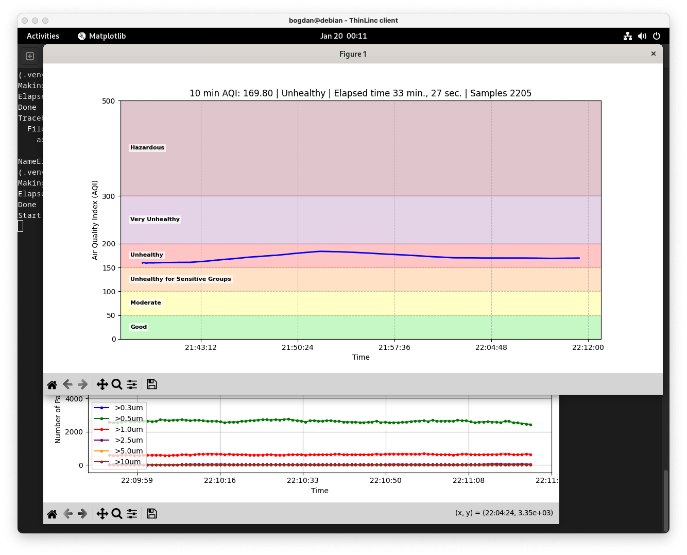
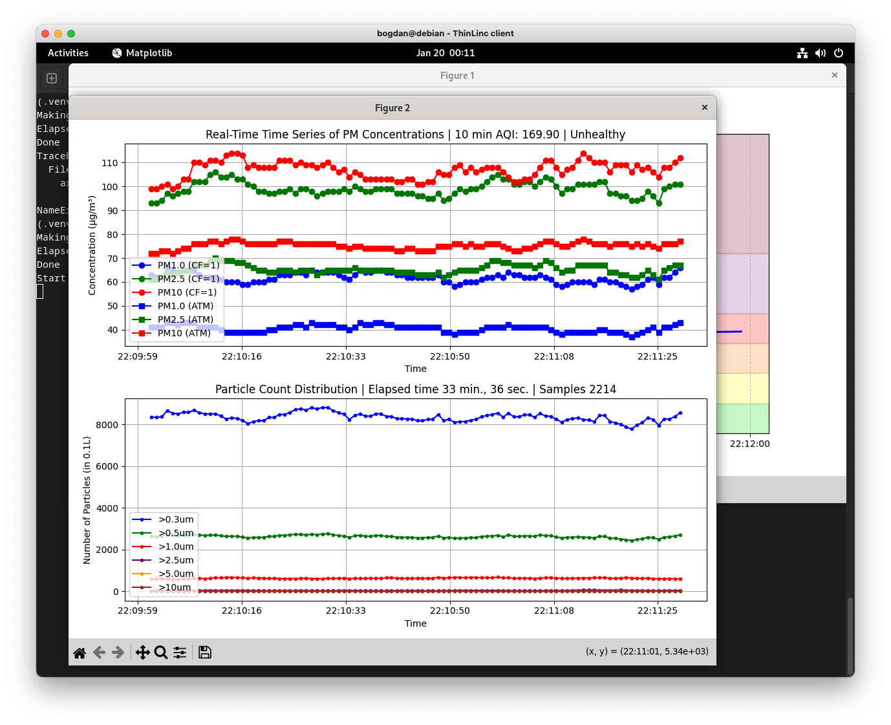

# 10 minutes Air Quality Index (AQI) computation
Python scripts for reading data from air quality sensors in passive mode, compute 10 min AQI and plot the data.

- air_quality_mono.py: script for displaying graphically the data obtained from one sensor

- air_quality_utils_mono.py: contains a class with utilities for AQI computation when data is received from one sensor and graphically displayed

The scripts have been tested on Debian 12 and use a slighty modified version of the interface below.

An usage example can be found [here](https://github.com/cristeab/aq_dashboard).

## Sample output

```console
10 min AQI: 22.10 | Good | Elapsed time 11:08 | Samples 758 | Rel. err. 25% | Spearman corr. 9%
#0 PM1.0: 7 ug/m3, PM2.5: 7 ug/m3, PM10: 7 ug/m3 | Particles in 0.1L of air: >0.3um 897, >0.5um 279, >10um 34, >25um 0, >50um 0, >100um 0
#1 PM1.0: 7 ug/m3, PM2.5: 5 ug/m3, PM10: 7 ug/m3 | Particles in 0.1L of air: >0.3um 759, >0.5um 230, >10um 34, >25um 2, >50um 2, >100um 0
```





# Plantower Particulate Sensor Python interface
A basic python interface for interacting with the plantower PM sensors.  This code has been tested with the following devices:
 * Plantower PMS5003
 * Plantower PMS7003
 * Plantower PMSA003
 
 It may work with other sensors from the plantower range, if you try it please do let us know either way.  If there are any problems with it please either raise an issue or fix it and issue a pull request.

The following persons have contributed to this library:
 * Philip J. Basford
 * Florentin M. J. Bulot
 * Simon J. Cox
 * Steven J. J. Ossont
 * serunis

